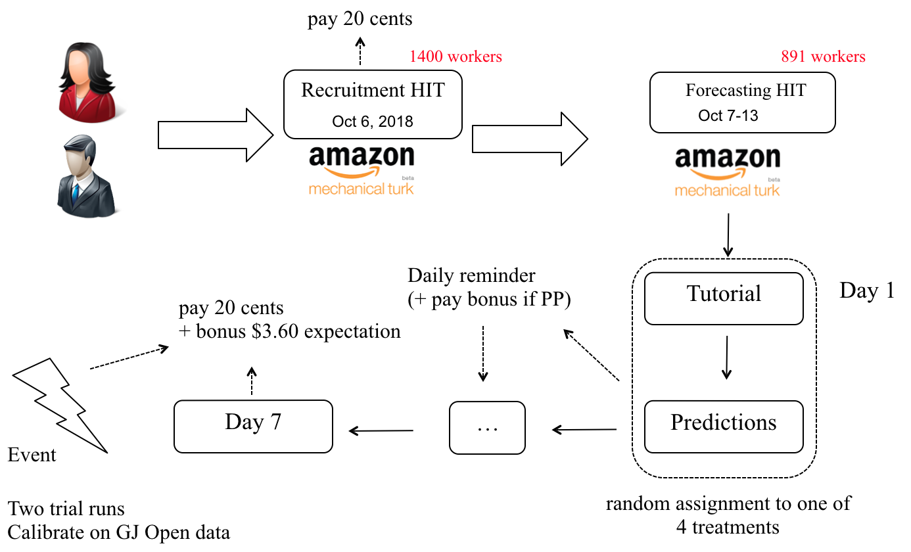

# PP-MTurk-AAAI2020

This github repository provides a brief summary of the paper [The Effectiveness of Peer Prediction in Long-Term Forecasting](http://www.columbia.edu/~dm3557/papers/mrp20.pdf) and contains the datasets used in the paper.

## Experimental Workflow

The experiment was run on Amazon Mechanical Turk (MTurk) and consisted of two HITs -- a *recruitment* HIT and a *forecasting* HIT, where the recruited workers participated in the actual study. The forecasting HIT was posted on October 7 and was online till October 13. Out of all the recruited workers, we considered about 900 workers who were present for the entire forecasting HIT. The workers were randomly assigned to one of the following four treatments. See the main paper for details about
the treatments.

1. **Scoring Rule** (SR)
2. **Peer Prediction** (PP)
3. **Scoring Rule + Peer Prediction (Rank)** (SR+PPRank)
4. **Scoring Rule + Peer Prediction** (SR+PP)

The figure above shows the details of the experiment. We asked the workers to provide forecasts on 18 different questions. There were three different categories of questions: (a) Sports, (b) Politics and Economy and (c) En-tertainment, with six questions from each category. The supplementary material includes the questions along with their outcomes.
